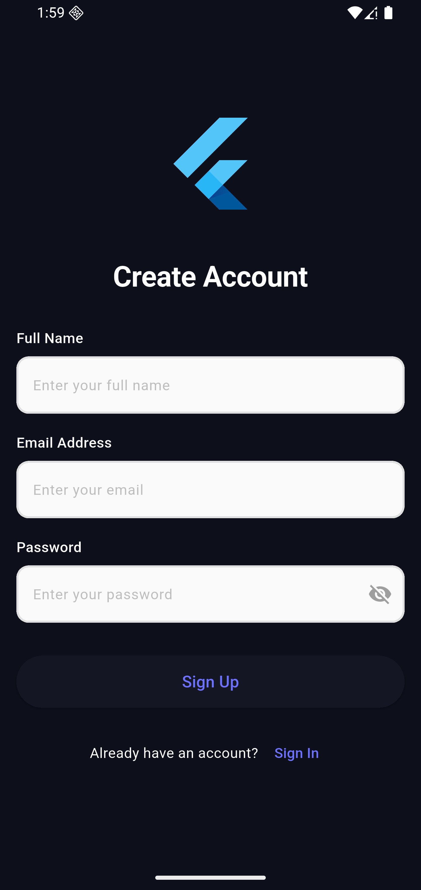
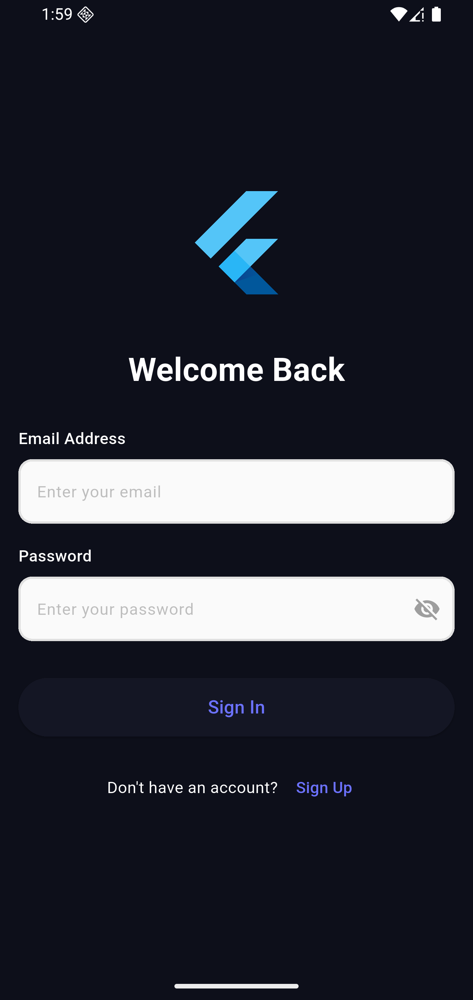
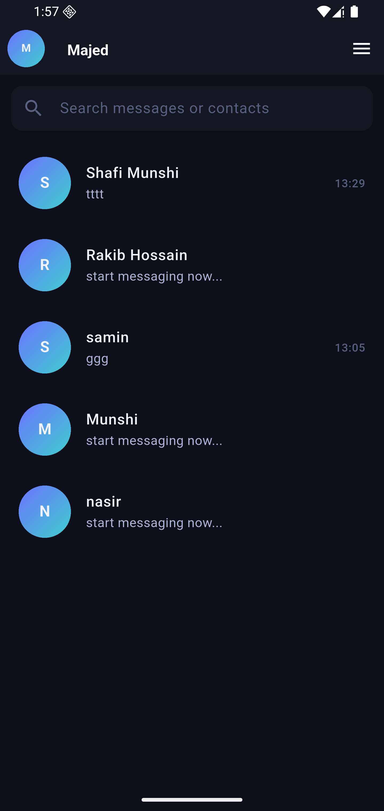

# Chat Application Task

  

A modern, real-time chat application built with Flutter and Firebase. This cross-platform mobile app offers seamless messaging experience, offline support, and beautiful Material Design UI.

## Project Overview
This chat application is designed to provide users with a comprehensive messaging platform featuring real-time communication and robust offline functionality. The app follows clean architecture principles and includes features like user authentication, message synchronization, and responsive design for both phones and tablets.

### Technical Stuff
- Followed **Clean Architecture** Pattern - Separation of concerns with domain, data, and views layers
-  used Riverpod for efficient state handling
- Firebase Firestore for real-time database and Auth for authentication
- SQLite for offline message storage
- Multiple flavors ( Development, Staging, Production)
- GoRouter - to handle route management
- All the business logic which are related to chat are working via Platfrom Channel

### Apps User Interface
<h3>Apps User Interface</h3>

<p align="center">
  
  
  
  
</p>
  

## ⚙️ Installation
Confiure this flutter version on your desk.

    - Flutter version : 3.32.4 
    - Dart version: 3.8.1

1.  **Clone the repository**
```bash

git clone https://github.com/ShafiMunshi/Chat_Application_Task.git

cd chat_application_task

```

2.  **Install Flutter dependencies**

```bash

flutter pub get

```

  

3.  **Generate code files**

```bash

dart run build_runner build --delete-conflicting-outputs

```

  

4.  **Firebase Setup**
The project is has all the firebase configuration related file, but if you like use owr own , follow this: 
- Create 3 new Firebase project (dev, staging, production) at [Firebase Console](https://console.firebase.google.com/)
- Enable Authentication and Firestore Database
- Download configuration files:

-  `google-services.json` for Android (place in `android/app/dev/` ,  `android/app/staging/` and  `android/app/prod/`)
  

## How to Run


  

**Run with specific environment**

```bash

# Development environment

flutter run --flavor dev -t lib/main_dev.dart \
--dart-define=ENV=dev \
--dart-define=APP_NAME="MyApp Dev"

# Production environment

flutter run --flavor prod -t lib/main_prod.dart
--dart-define=ENV=prod \
--dart-define=APP_NAME="MyApp"
# Staging environment

flutter run --flavor staging -t lib/main_staging.dart
--dart-define=ENV=staging
--dart-define=APP_NAME="MyApp Staging"

```
You can use also the vscode launch configuration what i always use: 
.vscode/launch.json
```json
{
"version": "0.2.0",

"configurations": [
	
{
		"name": "chat_application_task (profile mode)",
		"request": "launch",
		"type": "dart",
		"flutterMode": "profile"
		},
		{
		"name": "chat_application_task (release mode)",
		"request": "launch",
		"type": "dart",
		"flutterMode": "release"
	},
	{
		"name": "Dev",
		"request": "launch",
		"type": "dart",
		"program": "lib/main_dev.dart",
		"args": [
		"--flavor",
		"dev",
		"--dart-define=ENV=dev",
		"--dart-define=APP_NAME=MyApp Dev",
		"--dart-define=API_BASE_URL=https://dev.api.com",
		"--dart-define=ENABLE_LOG=true"
		]

	},
	{
		"name": "Staging",
		"request": "launch",
		"type": "dart",
		"program": "lib/main_staging.dart",
		"args": [
		"--flavor",
		"staging",
		"--dart-define=ENV=staging",
		"--dart-define=APP_NAME=MyApp Staging",
		"--dart-define=API_BASE_URL=https://staging.api.com",
		"--dart-define=ENABLE_LOG=true"
		]
	},
	{
		"name": "Production",
		"request": "launch",
		"type": "dart",
		"program": "lib/main_prod.dart",
		"args": [
		"--flavor",
		"prod",
		"--dart-define=ENV=prod",
		"--dart-define=APP_NAME=MyApp",
		"--dart-define=API_BASE_URL=https://api.com",
		"--dart-define=ENABLE_LOG=false"
		]
	}
	]
}
```

  

## 📁 Project Structure

```

lib/

├── core/ # Core functionality

│ ├── config/ # App configuration

│ ├── constants/ # App constants (colors, strings, etc.)

│ ├── errors/ # Error handling

│ ├── logger/ # Logging utilities

│ ├── routes/ # App routing

│ ├── services/ # Core services (speech-to-text)

│ ├── shared/ # Shared components and providers

│ └── style/ # App styling and themes

│

├── features/ # Feature modules

│ ├── auth/ # Authentication feature

│ │ ├── data/ # Data layer (repositories, models)

│ │ ├── domain/ # Domain layer (entities, use cases)

│ │ └── views/ # Presentation layer (screens, widgets)

│ │

│ └── chat/ # Chat feature

│ ├── data/ # Data layer

│ ├── domain/ # Domain layer

│ └── views/ # Presentation layer

│

├── firebase_options_*.dart # Firebase configuration files

└── main_*.dart # App entry points for different environments

```
